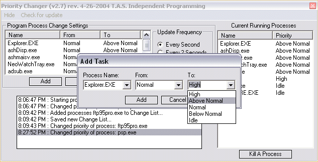



## Program Priority Changer 2\.8 2K &  XP Only

### Description

Set the CPU priority of each of your programs for higher performance. Runs in the tray monitoring & adjusting each of your programs cpu priority the minute they load & allows you to set your programs individually to what runs best on your particular computer. You have a choice of High, Above Normal, Normal, Below Normal or Idle. Works great on all programs. If you cant configure several system speed increases with this program, Nothing Will !!!! Special thanks goes out to Brandon Kampschuur for the main core that he submitted in 2001 ! http://planet-source-code.com/vb/scripts/ShowCode.asp?txtCodeId=26281&lngWId=1 I have done a ton of improvements to the GUI, also error handling, now it is a complete app. Enjoy ! You must have administrator rights to use this program !
 
### More Info
 

             |
---                |---
**Submitted On**   |2004-04-28 06:29:10
**By**             |[Thomas Swift](https://github.com/Planet-Source-Code/PSCIndex/blob/master/ByAuthor/thomas-swift.md)
**Level**          |Intermediate
**User Rating**    |5.0 (20 globes from 4 users)
**Compatibility**  |VB 6\.0
**Category**       |[Complete Applications](https://github.com/Planet-Source-Code/PSCIndex/blob/master/ByCategory/complete-applications__1-27.md)
**World**          |[Visual Basic](https://github.com/Planet-Source-Code/PSCIndex/blob/master/ByWorld/visual-basic.md)
**Archive File**   |[Program\_Pr1738484282004\.zip](https://github.com/Planet-Source-Code/thomas-swift-program-priority-changer-2-8-2k-xp-only__1-53443/archive/master.zip)

